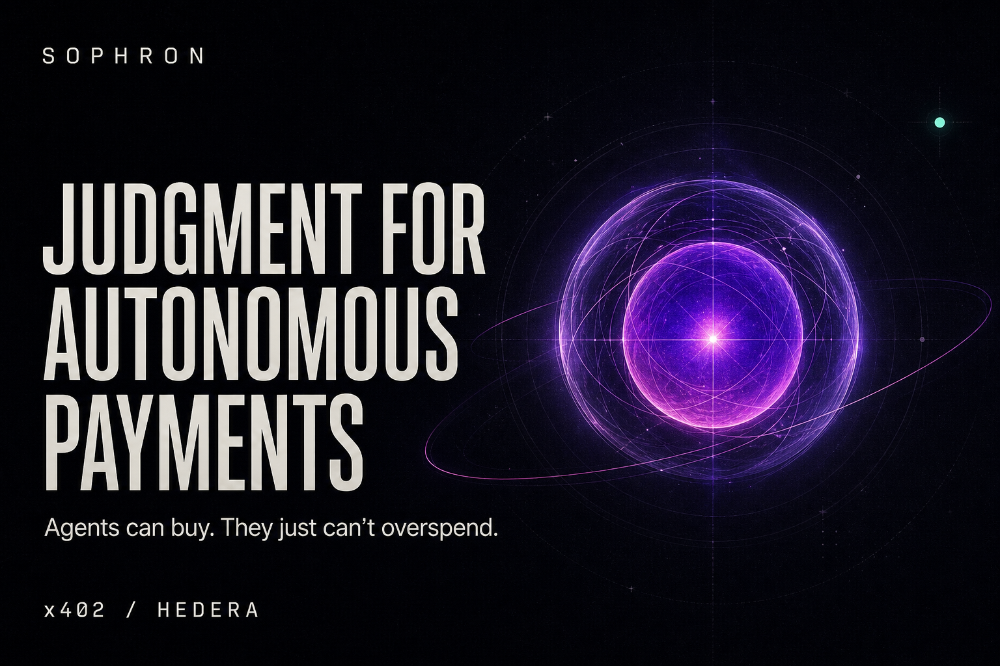
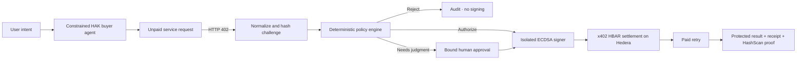

<div align="center">
  

  # Sophron

  **Judgment for autonomous payments.**

  A deterministic policy plane between an AI agent's intent and the moment money moves—built with x402 on Hedera.

  [Live product site](https://sophronweb.vercel.app/) · [Interactive control plane](https://sophronweb.vercel.app/dashboard) · [Automatic payment proof](https://hashscan.io/testnet/transaction/0.0.7162784%401785533654.932347649) · [Approved payment proof](https://hashscan.io/testnet/transaction/0.0.7162784%401785533722.313467338)

  
  
  
  
  [](LICENSE)
</div>

<br />



## Agents can pay. They should not control policy.

x402 gives software the ability to pay software. Sophron supplies the missing control boundary: deterministic rules that decide whether an agent **may** pay before a signing key is ever invoked.

The model chooses an objective and a service. Sophron—not the model—owns the merchant allowlist, destination, amount, asset, network, per-request ceiling, daily budget, approval threshold, signing, and receipt.

> **The agent owns intent. Policy owns money.**

## Three decisions, one end-to-end flow

| Scenario | Policy decision | Result |
|---|---|---|
| Trusted risk report · `0.01 HBAR` | Below the `0.02 HBAR` approval threshold | Automatically authorized, settled, retried, and unlocked |
| Trusted market brief · `0.03 HBAR` | Above the approval threshold | Budget reserved, human approval required, then settled and unlocked |
| Unknown provider · `0.005 HBAR` | Merchant and destination not allowlisted | Rejected before signing; no transaction exists |

These are not UI-only states. The live demo exercises the complete `402 → policy → settlement → retry → receipt` path against Hedera testnet.

## Verifiable Hedera testnet payments

| Flow | Amount | Outcome | On-chain proof |
|---|---:|---|---|
| Automatic risk-report purchase | `0.01 HBAR` | Fulfilled | [HashScan transaction `…3654.932347649`](https://hashscan.io/testnet/transaction/0.0.7162784%401785533654.932347649) |
| Human-approved market-brief purchase | `0.03 HBAR` | Fulfilled | [HashScan transaction `…3722.313467338`](https://hashscan.io/testnet/transaction/0.0.7162784%401785533722.313467338) |
| Unknown merchant attempt | `0 HBAR moved` | Rejected | Intentionally no transaction |

Each fulfilled attempt stores the Hedera transaction ID, HashScan URL, protected response receipt, policy reasons, and append-only audit events.

## How it works



1. The buyer agent selects a service through one constrained Hedera Agent Kit tool.
2. The resource is requested without payment and returns `HTTP 402 Payment Required`.
3. Sophron normalizes the challenge, verifies its resource, origin, merchant, destination, network, asset, and integer amount, then hashes it.
4. The pure policy engine chooses `rejected`, `pending_approval`, or `authorized` and atomically reserves budget when necessary.
5. Approval is bound to the exact challenge. Before signing, Sophron fetches a fresh challenge and reruns the full policy.
6. The isolated signer completes the x402 payment in HBAR on Hedera testnet.
7. Sophron retries the protected request, persists the result and settlement receipt, and exposes the HashScan proof.

The payment gate implementing this two-request protocol lives in [`src/payment/gate.ts`](src/payment/gate.ts). The pure monetary rules live in [`src/policy/engine.ts`](src/policy/engine.ts).

## Why Hedera

Sophron is designed for payments too small and frequent for conventional billing rails. Hedera provides the properties that make agent-to-agent and pay-per-call commerce practical:

- **Predictable, low-cost settlement** for per-use purchases measured in fractions of HBAR.
- **Fast finality** so a paid request can be retried and unlocked within one agent workflow.
- **Native HBAR transfers through Hedera Crypto Service**, used here on testnet.
- **Public verification through HashScan**, turning every fulfilled purchase into independently inspectable evidence.
- **Hedera-native developer tooling** through the Hiero SDK, Hedera Agent Kit v4, and the x402 Hedera exact scheme.

The current integration uses:

| Component | Role |
|---|---|
| Hedera testnet + Crypto Service | Real HBAR micropayment settlement |
| `@x402/hedera` `2.16.0` | Hedera exact-scheme payment support |
| `@x402/core`, `@x402/fetch`, `@x402/hono` | Challenge, payment, retry, and server integration |
| Hiero SDK `2.86.2` | Hedera account and transaction primitives |
| Hedera Agent Kit `4.0.0` | Constrained agent purchase tool |
| Blocky402 testnet facilitator | x402 verification and settlement orchestration |

Integration versions are exact-pinned in [`package.json`](package.json) for reproducibility.

## The safety boundary

Sophron assumes model output is untrusted. Its core invariants are enforced in deterministic TypeScript and SQLite transactions:

- Monetary values are integer tinybar strings—never floating-point numbers.
- The service catalog owns the merchant, resource path, and expected price.
- Policy validates merchant ID **and** destination account/origin.
- Active reservations count against the UTC-day budget, preventing concurrent overspend.
- Human approval is tied to one immutable challenge hash and expires with its reservation.
- A fresh challenge and full policy recheck occur immediately before signing.
- Rejected attempts cannot reach the signer.
- Audit events and receipts survive independently of the model conversation.

## Live experience

- **Product site:** [sophronweb.vercel.app](https://sophronweb.vercel.app/)
- **Control plane:** [sophronweb.vercel.app/dashboard](https://sophronweb.vercel.app/dashboard)

The Vercel deployment is the static product experience and clearly labeled interactive fixture dashboard. The bounty video demonstrates the live Node backend and real Hedera testnet flow; the HashScan links above independently verify its settlements.

## Run the complete demo locally

### Requirements

- Node.js 20+
- A funded **ECDSA Hedera testnet** buyer account
- A Hedera testnet receiver account

### 1. Install and configure

```bash
npm install
cp .env.example .env
```

Set the required values in `.env`:

```dotenv
PAY_TO_ACCOUNT=0.0.<seller-account>
HEDERA_CLIENT_ID=0.0.<funded-ecdsa-buyer>
HEDERA_CLIENT_KEY=<ecdsa-private-key>
```

Never place the buyer key in frontend variables, prompts, logs, or committed files. `OPENAI_API_KEY` is optional: without it, the same HAK v4 tool executes with deterministic service selection, while policy and signing remain identical.

### 2. Start the API and dashboard

```bash
# terminal 1
npm run dev

# terminal 2
npm run web:dev
```

Open `http://localhost:4321/dashboard`. The dashboard should report **Live API**.

### 3. Prove all three decisions

```bash
npm run demo
```

The script resets disposable demo state and fails unless it observes:

```text
PASS automatic purchase: fulfilled
PASS unknown merchant blocked: rejected
PASS high-cost purchase paused: pending_approval
PASS human-approved purchase: fulfilled
```

It prints a fresh HashScan URL for each fulfilled purchase. For a rail-only `402 → sign → settle → 200` check, run `npm run e2e`.

## Default policy

All monetary limits are deterministic integer tinybar values.

| Rule | Default |
|---|---:|
| Maximum per request | `0.05 HBAR` |
| UTC calendar-day limit | `0.1 HBAR` |
| Human approval required above | `0.02 HBAR` |
| Reservation lifetime | `15 minutes` |

The paid reports contain deterministic demo data and are not financial, security, credit, or compliance advice.

## API surface

| Method | Route | Purpose |
|---|---|---|
| `POST` | `/api/agent/run` | Submit purchase intent to the constrained agent |
| `GET` | `/api/policy` | Read policy and current UTC-day spend |
| `GET` | `/api/attempts` | List payment attempts |
| `GET` | `/api/attempts/:id` | Read one attempt and its audit trail |
| `POST` | `/api/attempts/:id/approve` | Approve and continue one bound challenge |
| `POST` | `/api/attempts/:id/deny` | Deny the attempt and release its reservation |
| `POST` | `/api/demo/reset` | Reset disposable state when demo mode is enabled |

## Verification

```bash
npm run check
```

The release gate runs strict backend typechecking, **46 backend tests**, Astro diagnostics, **9 frontend tests**, and the production web build. Coverage includes policy boundaries, malformed amounts, atomic reservations, approval binding, append-only audit records, signing isolation, mocked settlement, API contracts, and the constrained HAK v4 tool.

## Project structure

```text
src/agent/       constrained Hedera Agent Kit tool and optional model loop
src/payment/     challenge normalization, isolated signer, payment gate
src/policy/      pure deterministic policy evaluator
src/storage/     SQLite workflow state, reservations, events, receipts
src/server/      Hono paid resources and dashboard API
src/providers/   deterministic protected demo resources
scripts/         live rail test and three-decision demo
web/             cinematic landing page and control plane
```

## Scope

Sophron is a testnet, single-operator bounty MVP. Mainnet custody, multi-user authorization, merchant onboarding, refunds, disputes, and production authentication are deliberately outside the submission scope. The browser approval API is intended for the trusted local demonstration and must gain authentication and CSRF protection before public backend deployment.

## Acknowledgments

Sophron builds on the open x402 protocol and Hedera packages, Hedera Agent Kit, Hiero SDK, the hosted Blocky402 testnet facilitator, and the [`matevszm/x402-hedera-example`](https://github.com/matevszm/x402-hedera-example) reference implementation.

## License

Released under the [MIT License](LICENSE).
